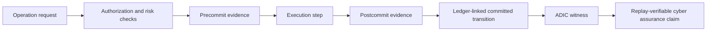

# ADIC Cyber Assurance Gateway

[](https://github.com/GhostDriftTheory/adic-cyber-assurance-gateway/actions/workflows/ci.yml)

This repository contains a Lean 4 proof-oriented demo for the ADIC Cyber Assurance Gateway.

It formalizes a small authorization/evidence/replay core showing that a protected cyber operation should not be treated as an accepted committed transition merely because an AI, agent, script, or runtime process produced an action.  Acceptance requires a linked evidence structure: authorization facts, pre/post ledger entries, state digests, approval validity, semantic execution, and an effect bound.

ADIC means **Advanced Data Integrity by Ledger of Computation**.  In this repository, ADIC refers to an audit and verification architecture for replayable decision evidence.  It is unrelated to p-adic numbers.

## Conceptual flow



The main point is simple:

> A committed protected transition must be backed by replayable evidence links, not by an unverifiable runtime assertion.

## Main Lean file

```text
adic_cyber_assurance_gateway.lean
```

## What this proof establishes

The central theorem is:

```text
committed_transition_yields_witness
```

At a high level, it proves:

> If a transition is committed by the ledger predicate `CommittedByLedger`, then Lean can construct an `ADICWitness` satisfying `ValidADICWitness`.

This witness links together:

```text
ledger validity
precommit and postcommit entries
pre/post state digests
entry validity
effect-bound validity
approval validity
semantic execution
execution-path validity
```

The proof is deliberately non-circular: `CommittedByLedger` is not defined as the existence of a witness.  Instead, the witness is constructed from ledger facts, entry facts, pre/post links, digest links, semantic execution, and approval/effect obligations.

## Why this matters for cyber assurance

Traditional security logs can show that something happened.  ADIC-style cyber assurance asks for a stronger property:

```text
Can the acceptance of the operation be replayed and checked from evidence?
```

This Lean artifact models that idea for a gateway-style setting.  It supports the claim that high-impact cyber or AI-agent actions should be accepted only through a verifiable evidence chain.

In this model, the gateway is not merely a monitor.  It is a proof-facing boundary between:

```text
generated action
authorization conditions
ledger commitment
replayable evidence
post-hoc verification
```

## Additional theorem directions

Representative checked statements include:

| Purpose | Lean identifier |
|---|---|
| Unknown operation is not silently accepted by the semantic model | `sem_unknown_operation_is_false` |
| The committed-ledger predicate is non-vacuous | `committed_by_ledger_nonempty` |
| A committed transition yields a valid ADIC witness | `committed_transition_yields_witness` |
| A valid witness contains semantic execution | `valid_witness_has_semantic_execution` |
| A valid witness keeps the effect within the over-approximation bound | `valid_witness_effect_is_within_phi` |
| Protected change requires a valid ADIC witness | `protected_change_requires_valid_adic_witness` |
| A rejected step has no protected effect | `blocked_operation_has_no_protected_effect` |
| Generated-only action does not authorize itself | `generated_only_does_not_authorize` |
| Committed effect stays within `phi` | `committed_effect_within_phi` |

## Non-vacuity

The repository includes a concrete satisfiability witness:

```text
committed_by_ledger_nonempty
```

This is important because a sound-looking theorem can be meaningless if its main assumption is impossible to satisfy.

Here, the artifact shows that the committed-ledger predicate has at least one concrete model.  The main theorem therefore does not rely on an empty premise.

## Trust boundary

The artifact intentionally isolates non-Lean-world assumptions in `namespace TCB`.

The TCB covers assumptions such as:

```text
state digest behavior
operation digest behavior
entry digest behavior
approval digest behavior
obligation digest behavior
signature validity
time validity
```

The proof does **not** prove real-world cryptographic security, real SHA-256 collision resistance, real signature security, wall-clock correctness, OS permissions, cloud IAM behavior, hardware isolation, or production implementation correctness.

Those are outside the Lean model and must be handled by engineering, deployment controls, and separate assurance mechanisms.

## Scope

This repository covers the Lean-side proof structure for a cyber-assurance gateway model.

It covers the relationship between:

```text
operation request
authorization policy
risk classification
approval validity
precommit entry
postcommit entry
ledger validity
state digest links
semantic execution
effect-bound checking
ADIC witness construction
```

It does not cover:

```text
Completeness of the gateway policy
Correctness of a production Python implementation
Correctness of external cloud/IAM enforcement
Network security
Endpoint security
Cryptographic security of concrete hash/signature schemes
Attack detection quality
The mapping from every real-world cyber event to this formal model
```

The goal is not to prove an entire deployed cyber defense system.  The goal is to provide a mechanically checked formal core for replay-verifiable gateway acceptance.

## Reproducibility

This repository is intended to be reproducible with Lean 4.

For a minimal single-file check:

```bash
lean adic_cyber_assurance_gateway.lean
```

For a Lake-based repository:

```bash
git clone https://github.com/GhostDriftTheory/adic-cyber-assurance-gateway.git
cd adic-cyber-assurance-gateway
lake build
```

Successful verification means that Lean completes without errors.

## Recommended repository structure

```text
adic_cyber_assurance_gateway.lean      Main Lean formalization
lean-toolchain                         Lean toolchain pin
lakefile.toml or lakefile.lean          Lake project file, if using Lake
lake-manifest.json                     Lake dependency lock file, if dependencies are used
.github/workflows/ci.yml               GitHub Actions Lean verification workflow
README.md                              Repository description
```

## Verification evidence

The primary verification evidence is:

```text
fresh clone -> lean adic_cyber_assurance_gateway.lean
```

or, for Lake:

```text
fresh clone -> lake build
```

The GitHub Actions workflow should run the same verification command on every push and pull request.

Screenshots may be kept as supplementary evidence, but they are not the reproducibility mechanism.

## Axiom audit

The Lean file ends with explicit axiom-audit commands:

```text
#print axioms ADIC.sem_unknown_operation_is_false
#print axioms ADIC.NonVacuity.committed_by_ledger_nonempty
#print axioms ADIC.committed_transition_yields_witness
#print axioms ADIC.valid_witness_has_semantic_execution
#print axioms ADIC.valid_witness_effect_is_within_phi
#print axioms ADIC.protected_change_requires_valid_adic_witness
#print axioms ADIC.blocked_operation_has_no_protected_effect
#print axioms ADIC.generated_only_does_not_authorize
#print axioms ADIC.committed_effect_within_phi
```

Expected dependencies are the explicit `TCB.*` assumptions plus Lean's ordinary classical/propositional axioms.

Unexpected dependencies, especially `sorryAx`, indicate that the trust boundary has leaked or that an unfinished proof remains.

## How to read the result

The result should be read as a formal core for ADIC-style cyber assurance:

```text
If a protected transition is accepted as ledger-committed,
then the acceptance can be backed by a constructed ADIC witness.
```

This is stronger than a narrative audit log and narrower than a full cyber-defense proof.

The intended claim is:

```text
Gateway acceptance becomes replay-verifiable evidence.
```
